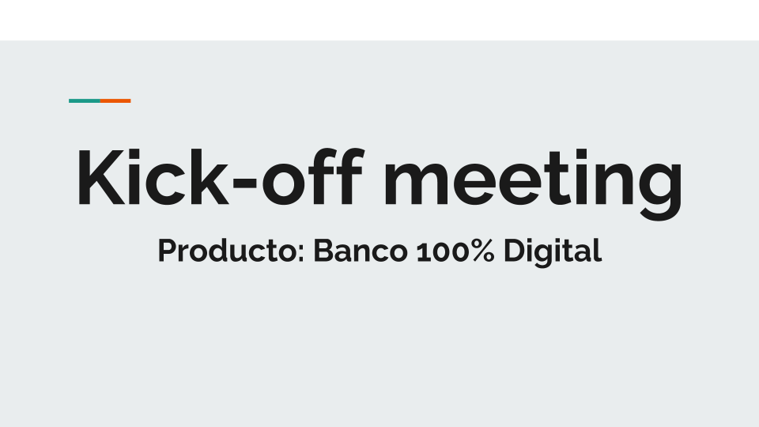
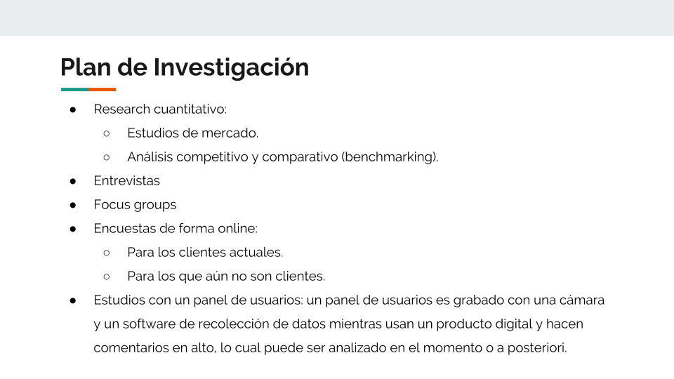
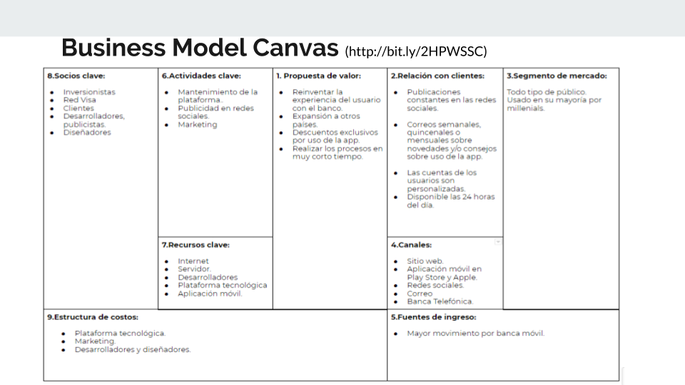
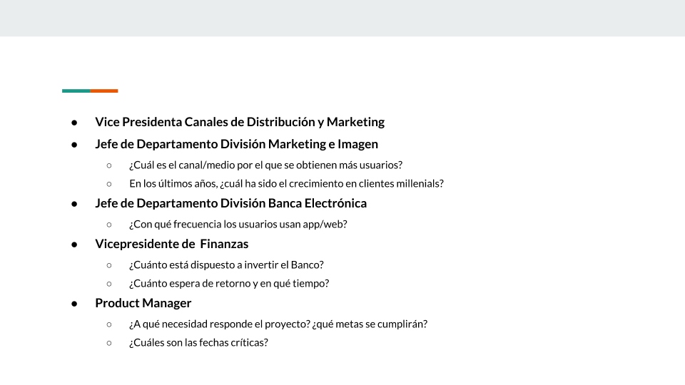
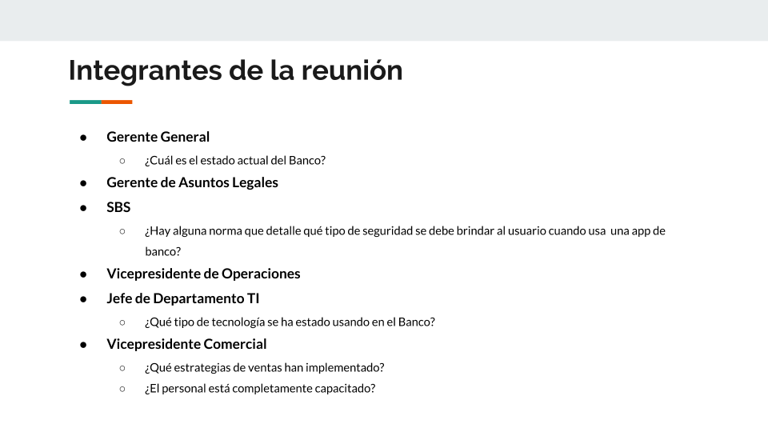
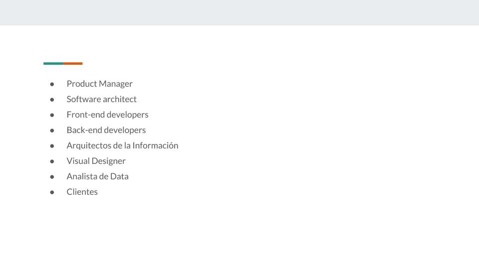

#Banco del País: 100% digital

## Reto:

¿Recuerdas el caso del nuevo banco digital para millenials? Bueno, seguiremos trabajando en eso. Ahora, te pedimos que con las respuestas de tus stakeholders replantees tu plan de research.

Además, deberás:

* Llevar a cabo las actividades de investigación.
* Crear un prototipo de la nueva banca digital - basado en el journey más crítico que encuentres en tu investigación.
* Hacer sesiones de testing.
* Iterar y concluir.

### Kick-off Meeting

### Respuestas del Kick-off Meeting

**1. Gerente General**

* ¿Cuál es el estado del banco?

El estado actual del banco es bueno pero queremos expandirnos y abarcar más segmentos de clientes. Es por ello que tenemos como objetivo a los millenials y aprovechar el acceso que tienen a la tecnología.

**2. Gerente de Asuntos Legales, SBS**

* ¿Hay alguna norma que detalle qué tipo de seguridad se le debe brindar al usuario cuando usa una aplicación del banco?

En general, proteger las contraseñas y cuentas de los usuarios es nuestra prioridad así como también los datos personales y garantizar el secreto bancario.

Respuesta basado en :https://es.wikipedia.org/wiki/Seguridad_de_aplicaciones_web

**3. Jefe de Departamento TI**

* ¿Qué tipo de tecnología se ha estado usando en el banco?

La  tecnología que se ha estado usando han sido los cajeros multifuncionales con una gran número de dispositivos opcionales como dispensador de tickets, un sistema de reconocimiento del usuario a través de su huella digital y la página web del banco que les facilite el uso de la banca por internet y banca móvil.

**4. Vicepresidente Comercial**

* ¿Qué estrategias de venta han implementado?

Hasta el momento, se han utilizado la publicidad en paneles, un espacio en los programas de televisión (comercial), publicidad en redes sociales y correos.

* ¿El personal está completamente capacitado?

El personal está completamente capacitado tanto para la atención presencial y telefónica. En el caso de la digitalización del banco tendríamos que capacitar a nuestro personal para los nuevos productos.

**5. Vicepresidenta Canales de Distribución y Marketing, Division Marketing e Imagen**

* ¿Cuál es el canal/medio por el cual se obtienen más usuarios?

El medio por el cual se obtienen más usuarios es el digital ya que en la web y redes sociales se respalda una mejor llegada a usuarios con acceso a Internet y tecnología.

* En los últimos años, ¿cuál ha sido el crecimiento de clientes millenials?

El crecimiento de los clientes millenials ha sido de un 4% respecto del año pasado.

**6. Jefe de Departamento División Banca Electrónica**

* ¿Con qué frecuencia los usuarios utilizan app/web?

Alrededor de 5 a 8  veces al día.

**7. Vicepresidente de Finanzas**

* ¿Cuánto está dispuesto a invertir el banco? ¿Cuánto espera de retorno y en qué tiempo?

No hay un límite de inversión y se espera el retorno no a nivel monetario sino en un crecimiento del 10% de clientes millennials.

**8. Product Manager**

* ¿A qué necesidad responde el proyecto? 

Al incremento de la penetración en el segmento de los millennials y por ende, en el crecimiento  en nuestra base de clientes. En un mediano/largo plazo la fidelización de estos clientes.

#### Research

### AFFINITY MAP

#### Temas encontrados

* Ocupación
* Uso de tarjeta de débito
* Uso de tarjeta de crédito
* Otros servicios (seguros, AFP)
* CTS
* Bancos preferidos
* Motivos de la preferencia
* App/Web
* Operaciones Frecuentes
* Dificultad en el uso de la app
* Seguridad en el uso de la app
* Banca presencial
* Recomendaciones

#### Priorización y Selección del problema

El problema principal es hacer un banco 100% digital, en ese sentido, se convertirán la mayor parte de procesos presenciales/omnicanal a digitales en una app móvil. 

#### User persona primario
**Nombre:**  Giuliana Obregón. 

**Edad:** 23.

**Género:** femenino.

**Profesión:** Diseñadora Gráfica.

**Lugar de residencia:** Magdalena del Mar.

**Escenario:**  Giuliana es una diseñadora gráfica sin hijos que trabaja en Amable y que por motivos de trabajo no tiene tanto tiempo. Para simplificar su día a día usa aplicativos móviles. 

#### Problem statements

* Giuliana necesita una aplicación para ver sus saldos para poder organizar sus gastos.
* Giuliana necesita renovar su tarjeta de forma sencilla cuando la pierde.
* Giuliana necesita poder ver los movimientos de su cuenta sin acceder a la app.
* Giuliana necesita visualizar instrucciones para operaciones que no conoce.

#### How might we

* ¿Cómo podríamos hacer que el usuario visualice todos los saldos de sus cuentas?
* ¿Cómo podríamos resolver los problemas con la tarjeta de los usuarios?
* ¿Cómo podríamos eliminar el tiempo invertido en la renovación de la tarjeta?
* ¿Cómo podríamos ayudar al usuario a abrir una cuenta corriente?
* ¿Cómo podríamos absolver las dudas y quejas de los usuarios?
* ¿Cómo podríamos calendarizar el envío del estado de cuenta de los usuarios?
* ¿Cómo podríamos hacer que los usuarios realicen las operaciones más rápido?
* ¿Cómo podríamos realizar operaciones sin token?

#### What if…

* ¿Que tal si no necesita salir de la aplicación para saber cómo realizar ciertas operaciones?
* ¿Qué tal si resolvemos las dudas o quejas de los usuarios en tiempo real?
* ¿Que tal si los estados de cuenta de los usuarios llegan cada fin de semana?
* ¿Que tal si los usuarios tiene un asistente virtual?
* ¿Que tal si se utilizan los mensajes de texto o touch ID para confirmar transacciones?
* ¿Que  tal si no necesita ir al banco para renovar su tarjeta?

#### Feature List

* Loguearse con el número de DNI.
* Listado de todos los saldos y cuentas.
* Transferencias con el número de celular.
* Confirmar operación por mensaje de texto.
* Confirmar operación por touch ID.
* Pagos de servicios.
* Confirmar operación por mensaje de texto.
* Confirmar operación por touch ID.
* Dudas y Reclamos 
* Brindar ayuda por chatbox.
* Seguimiento a reclamos.
* Descargar como PDF el estado de cuenta.
* Bloqueo de tarjeta de débito.
* Tramitar la renovación de tu tarjeta.
* Abrir una cuenta ahorros.
* Ver tutoriales de las operaciones (en todas las operaciones).

#### Content Prototyping

