# Banco Digital

Banco Digital es una aplicación móvil del Banco del País cuyo propósito es ser un banco 100% digital para millenials. 

### Desarrollado para

* [Laboratoria](http://talento.laboratoria.la/)

***

## **Banco del País: 100% digital**

## El Reto

El Banco del País es uno de los bancos más importante de tu país. Es una institución de muchos años y actualmente está pasando por un proceso de transformación digital. Como parte de este proceso, han implementado un área de innovación que quiere llegar de una mejor manera a los usuarios más jóvenes. Por lo que, inspirados en Nequi, Nubank y Simple se han propuesto crear un banco 100% digital dirigido para millenials. Es tu primera semana en la empresa y te han pedido que te encargues de esa investigación.

## Objetivos

* Identificar a los stakeholders del proyecto
* Planear una reunión kick-off
* Realizar el Business Model Canvas
* Realizar un plan de investigación
* Llevar a cabo las actividades del plan de investigación
* Crear un prototipo de la nueva banca digital
* Hacer sesiones de testing
* Hacer iteraciones

## Kick-off Meeting

## Respuestas del Kick-off Meeting

**1. Gerente General**

* ¿Cuál es el estado del banco?

_El estado actual del banco es bueno pero queremos expandirnos y abarcar más segmentos de clientes. Es por ello que tenemos como objetivo a los millenials y aprovechar el acceso que tienen a la tecnología._

**2. Gerente de Asuntos Legales, SBS**

* ¿Hay alguna norma que detalle qué tipo de seguridad se le debe brindar al usuario cuando usa una aplicación del banco?

_En general, proteger las contraseñas y cuentas de los usuarios es nuestra prioridad así como también los datos personales y garantizar el secreto bancario._

Respuesta basado en :https://es.wikipedia.org/wiki/Seguridad_de_aplicaciones_web

**3. Jefe de Departamento TI**

* ¿Qué tipo de tecnología se ha estado usando en el banco?

_La  tecnología que se ha estado usando han sido los cajeros multifuncionales con una gran número de dispositivos opcionales como dispensador de tickets, un sistema de reconocimiento del usuario a través de su huella digital y la página web del banco que les facilite el uso de la banca por internet y banca móvil._

**4. Vicepresidente Comercial**

* ¿Qué estrategias de venta han implementado?

_Hasta el momento, se han utilizado la publicidad en paneles, un espacio en los programas de televisión (comercial), publicidad en redes sociales y correos._

* ¿El personal está completamente capacitado?

_El personal está completamente capacitado tanto para la atención presencial y telefónica. En el caso de la digitalización del banco tendríamos que capacitar a nuestro personal para los nuevos productos._

**5. Vicepresidenta Canales de Distribución y Marketing, Division Marketing e Imagen**

* ¿Cuál es el canal/medio por el cual se obtienen más usuarios?

_El medio por el cual se obtienen más usuarios es el digital ya que en la web y redes sociales se respalda una mejor llegada a usuarios con acceso a Internet y tecnología._

* En los últimos años, ¿cuál ha sido el crecimiento de clientes millenials?

_El crecimiento de los clientes millenials ha sido de un 4% respecto del año pasado._

**6. Jefe de Departamento División Banca Electrónica**

* ¿Con qué frecuencia los usuarios utilizan app/web?

_Alrededor de 5 a 8  veces al día._

**7. Vicepresidente de Finanzas**

* ¿Cuánto está dispuesto a invertir el banco? ¿Cuánto espera de retorno y en qué tiempo?

_No hay un límite de inversión y se espera el retorno no a nivel monetario sino en un crecimiento del 10% de clientes millennials._

**8. Product Manager**

* ¿A qué necesidad responde el proyecto? 

_Al incremento de la penetración en el segmento de los millennials y por ende, en el crecimiento  en nuestra base de clientes. En un mediano/largo plazo la fidelización de estos clientes._

## Investigación

* Encuestas

[Enlace de encuesta](http://bit.ly/2FexMLi)

Las preguntas y resultado a continuación:

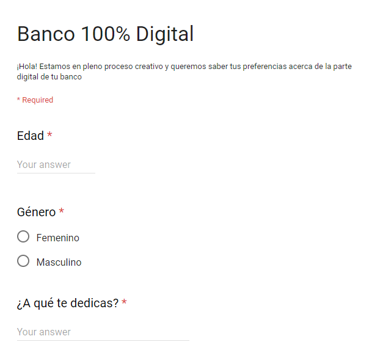
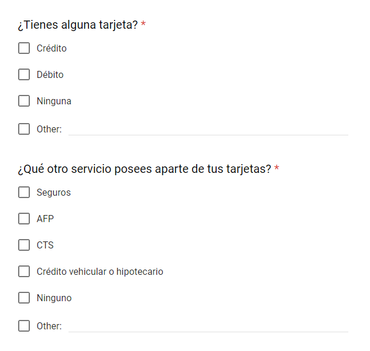
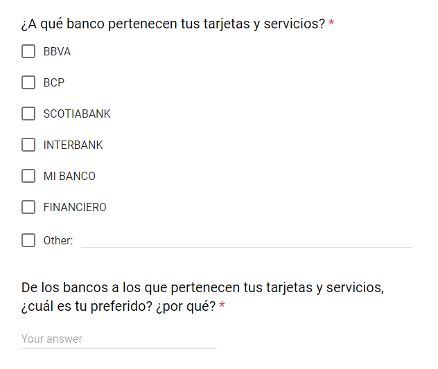
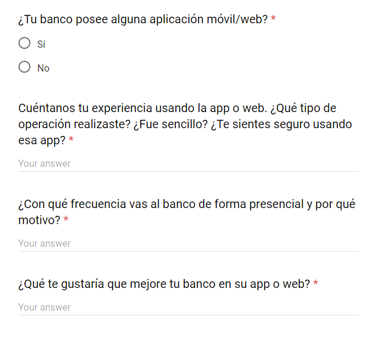
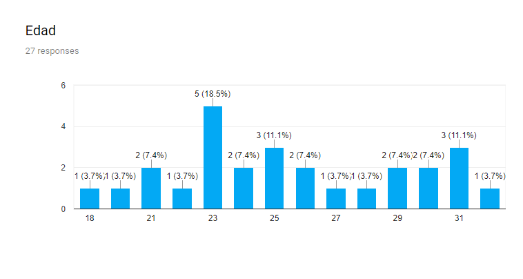
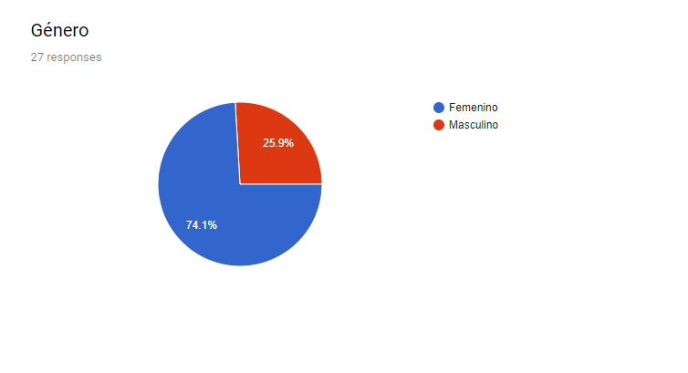
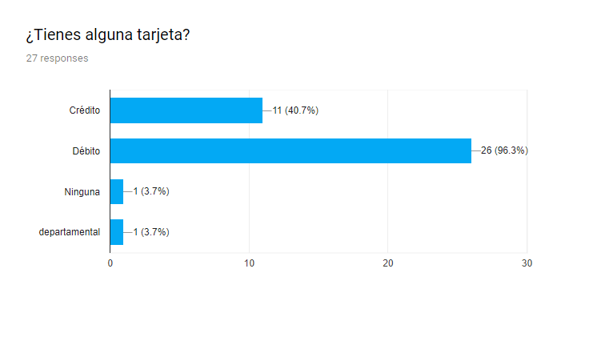
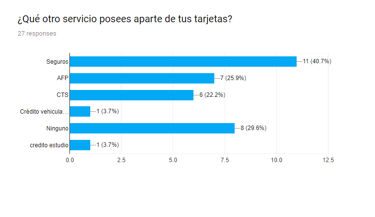
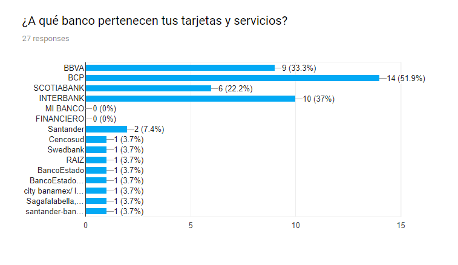
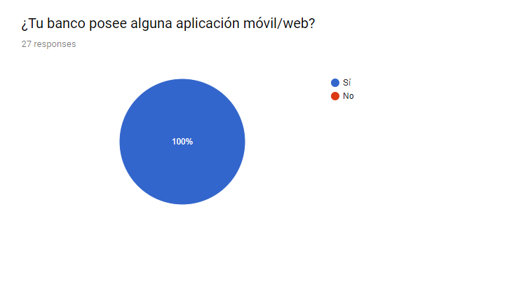
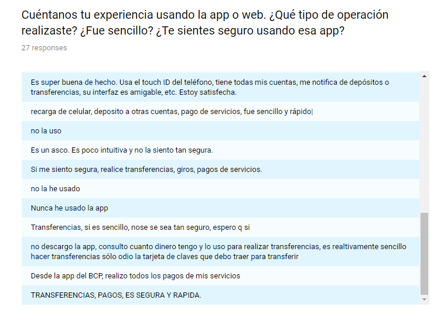
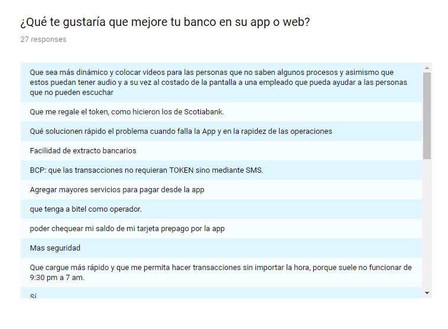

## Mapa de Afinidad

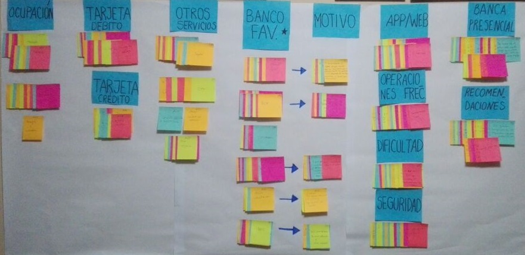

 **Temas encontrados**

* Ocupación
* Uso de tarjeta de débito
* Uso de tarjeta de crédito
* Otros servicios (seguros, AFP)
* CTS
* Bancos preferidos
* Motivos de la preferencia
* App/Web
* Operaciones Frecuentes
* Dificultad en el uso de la app
* Seguridad en el uso de la app
* Banca presencial
* Recomendaciones

## Priorización y Selección del problema

El problema principal es hacer un banco 100% digital, en ese sentido, se convertirán la mayor parte de procesos presenciales/omnicanal a digitales en una aplicación móvil. 

### User persona primario

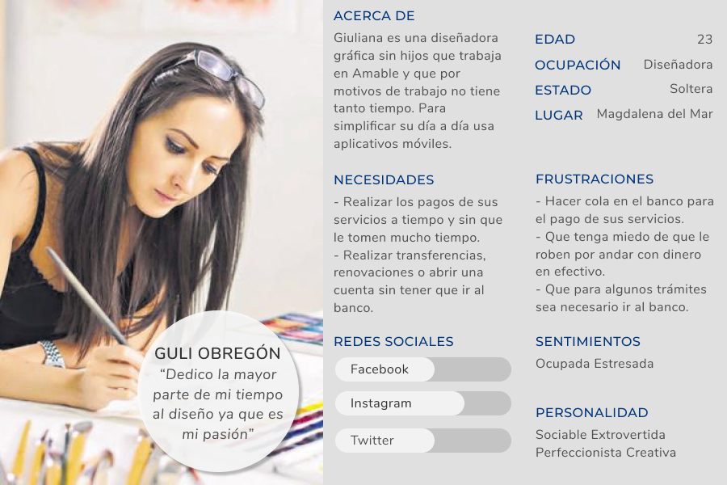

### Problem statements

* Giuliana necesita una aplicación para ver sus saldos para poder organizar sus gastos.
* Giuliana necesita renovar su tarjeta de forma sencilla cuando la pierde.
* Giuliana necesita poder ver los movimientos de su cuenta sin acceder a la app.
* Giuliana necesita visualizar instrucciones para operaciones que no conoce.

### How might we

* ¿Cómo podríamos hacer que el usuario visualice todos los saldos de sus cuentas?
* ¿Cómo podríamos resolver los problemas con la tarjeta de los usuarios?
* ¿Cómo podríamos eliminar el tiempo invertido en la renovación de la tarjeta?
* ¿Cómo podríamos ayudar al usuario a abrir una cuenta corriente?
* ¿Cómo podríamos absolver las dudas y quejas de los usuarios?
* ¿Cómo podríamos calendarizar el envío del estado de cuenta de los usuarios?
* ¿Cómo podríamos hacer que los usuarios realicen las operaciones más rápido?
* ¿Cómo podríamos realizar operaciones sin token?

### What if…

* ¿Que tal si no necesita salir de la aplicación para saber cómo realizar ciertas operaciones?
* ¿Qué tal si resolvemos las dudas o quejas de los usuarios en tiempo real?
* ¿Que tal si los estados de cuenta de los usuarios llegan cada fin de semana?
* ¿Que tal si los usuarios tiene un asistente virtual?
* ¿Que tal si se utilizan los mensajes de texto o touch ID para confirmar transacciones?
* ¿Que  tal si no necesita ir al banco para renovar su tarjeta?

### Feature List

* Loguearse con el número de DNI.
* Listado de todos los saldos y cuentas.
* Transferencias con el número de celular.
* Confirmar operación por mensaje de texto.
* Confirmar operación por touch ID.
* Pagos de servicios.
* Confirmar operación por mensaje de texto.
* Confirmar operación por touch ID.
* Dudas y Reclamos 
* Brindar ayuda por chatbox.
* Seguimiento a reclamos.
* Descargar como PDF el estado de cuenta.
* Bloqueo de tarjeta de débito.
* Tramitar la renovación de tu tarjeta.
* Abrir una cuenta ahorros.
* Ver tutoriales de las operaciones (en todas las operaciones).

### Content Prototyping

Banco del País
 
¡Hola, bienvenido a Banco del País. Para brindarte una experiencia elige una acción! 

1. Tengo una cuenta
2. Quiero abrir una cuenta
3. Quiero ser cliente

(​Elige: "Opción 1" ​ )

Por favor, selecciona el tipo de documento de identidad e ingresa el número de tu documento.

1. DNI
2. CE

(​Elige: "Opción 1" ​ y lo llena)

1. DNI-76127401

(Click en ingresar)

Genial, ahora ¿Qué deseas realizar?  

1. Ver saldos y estados de cuenta.
2. Abrir una cuenta.
3. Transferencias.
4. Pagar servicios.
5. Dudas y reclamos.
6. Operaciones con tarjetas.

(​Elige: "Opción 3")

Existen 4 formas de realizar transferencias, ¿cuál realizarás hoy?

1. A una de mis cuentas.
2. A cuentas de terceros.
3. A otros bancos.
4. A una persona sin tarjeta.

(​Elige: "Opción 4")

Selecciona la cuenta de origen de donde se descontará el monto por favor

1. Cuenta ahorros soles.
2. Cuenta ahorros dólares.

(​Elige: "Opción 1")

Ahora ingresa el monto que quieres transferir: 50 soles.

Por favor ingresa el número de DNI de la persona a recibir el dinero y su número de celular: 02038786, 944777545.

¿Deseas enviar un mail de constancia de trasnferencia? (opcional), no.

¿Cómo deseas confirmar tu trasnferencia?

1. SMS
2. Touch ID

(​Elige: "Opción 2")

Perfecto, coloca tu dedo para escanear tu huella...

Verificando...
Validando...

¡Listo! tu transferencia se ha realizado con éxito. ¿Qué deseas hacer ahora?

1. Ver saldo.
2. Realizar otra transferencia.
3. Salir

(​Elige: "Opción 3")

¡Gracias!

## Paper Prototyping

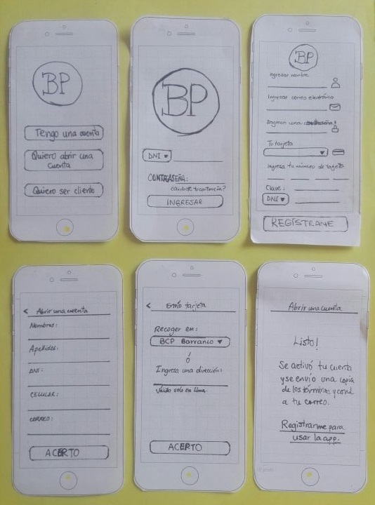
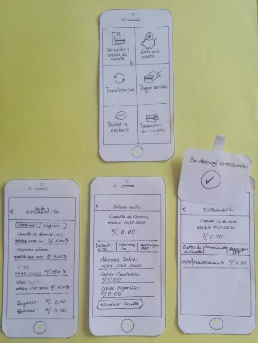
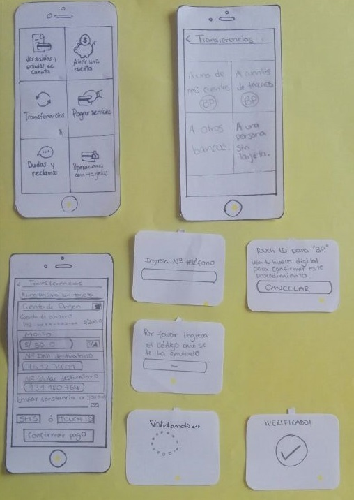
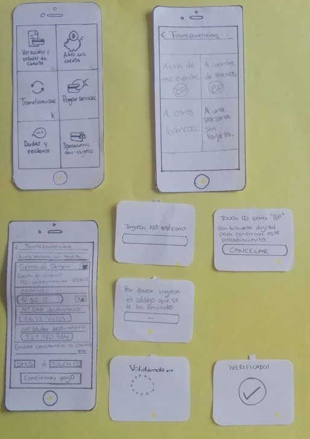
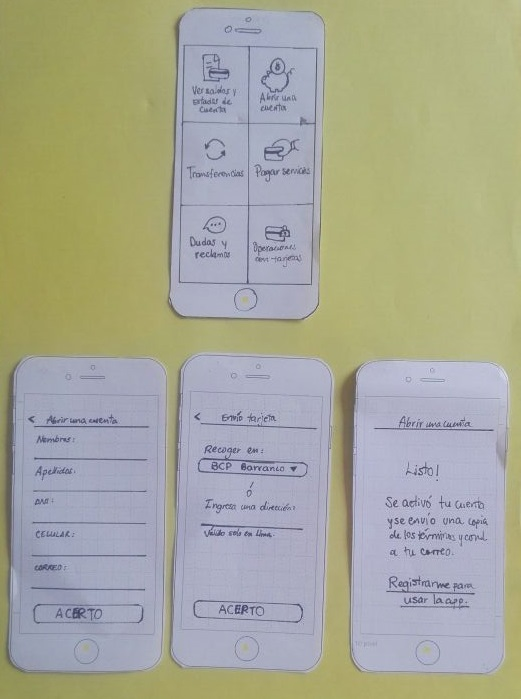
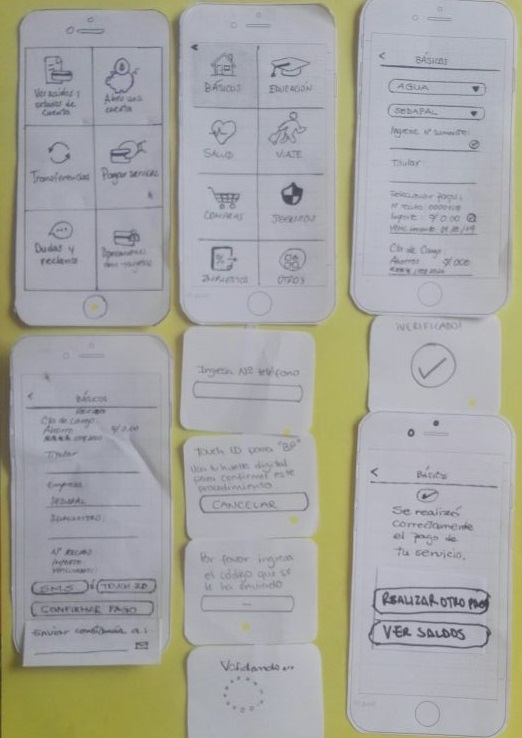

### Storytelling

Giuliana, es una joven de 23 años que desde pequeña ha interactuado con la tecnología. A sus 23 años, ya es una joven graduada de Diseño Gráfico y está planeando estudiar muchas cosas más. 

Aunque ama su trabajo en Amable la rutina la deja cansada, pero sobretodo, durante el día no tiene tiempo para acercarse a un banco si es que tiene un reclamo, desea hacer una trasnferencia o simplemente crear una cuenta. Siempre dice: "el sábado lo hago" porque sabe que entre semana es imposible,lamentablemente los sábados tampoco puede porque tiene que ir a trabajar y cuando sale del trabajo ya los bancos están cerrados. 

Un día, navegando por la web, descubrió la publicidad del Banco del País, decidió aventurarse y descubrió que este banco y su nueva app móvil le ofrecen lo que ella ha estado buscando con la seguridad necesaria para no tener que preocuparse por algún problema.

Giuliana ahora está más contenta porque cada vez que alguien le dice "qué problema esto de ir al banco", les cuenta sobre el Banco del País y en cómo ella dejó de preocuparse por ir al banco.

**Feedbacks**

* Usuaria 1: "Es amigable y fácil de usar pero deben agregarle un menú porque regresar tantas veces hacia atrás es cansado"

* Usuario 2: "Me agrada no tener que usar token y usar mi huella digital para poder confirmar mis transacciones"

## Prototipo de Alta Fidelidad V1.0

Después de los feedbacks, se implementaron esas mejoras y se creo el prototipo de alta fidelidad:

[Ver prototipo](http://bit.ly/2HotLVp)

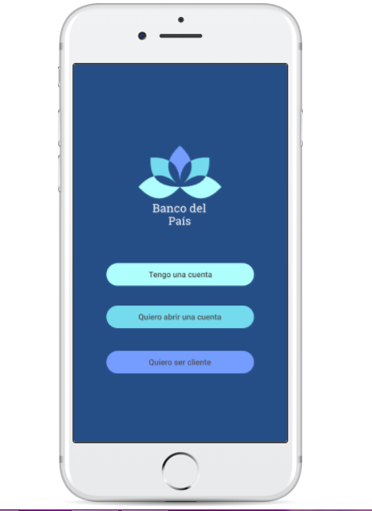

**Feedbacks**

1. Falla en el botón de retroceder.
2. Es bastante intuitivo y user friendly.
3. Es sencilla de usar, me sentí confiado y seguro para realizar mis operaciones gracias al Touch ID y el sms.
4. No podía elegir la opción de DNI después de elegir Carné de extranjería.
5. Los colores no son llamativos para interactuar con la aplicación.

## Prototipo de Alta Fidelidad V2.0

Recibido estos feedbacks se realizaron las mejoras respectivas.
Esta es la última versión de nuestro producto:

[Ver prototipo final](http://bit.ly/2FzxVt2)

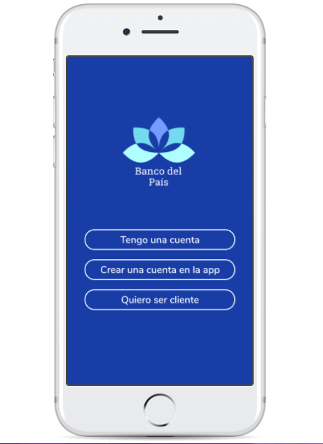

## Proyecto realizado por

* Shannon Rivera
* Rocío Quilla
